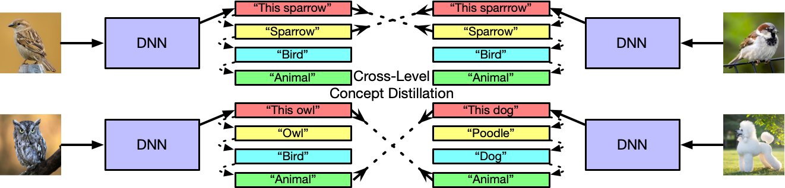

# Dynamic Metric Learning  with Cross-Level Concept Distillation

This repository is the official PyTorch implementation of **Dynamic Metric Learning with Cross-Level Concept Distillation**. 

## Framework



## Datasets 

The three DyML datasets can be downloaded from [here](https://github.com/SupetZYK/DynamicMetricLearning). Put the dataset files on ./datasets.

## Requirements

To install requirements:

```setup
pip install -r requirements.txt
```

## Training

To train the proposed CLCD method, run the following commands:

```python
bash command.sh
```
or
```python
bash command_product.sh
```


## Device 

We tested our code on a linux machine with two Nvidia RTX 3090 GPU cards. 

